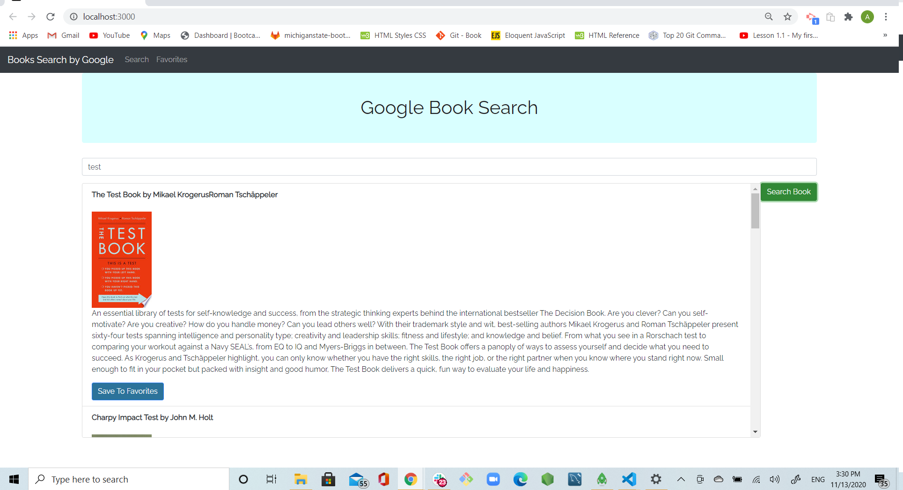
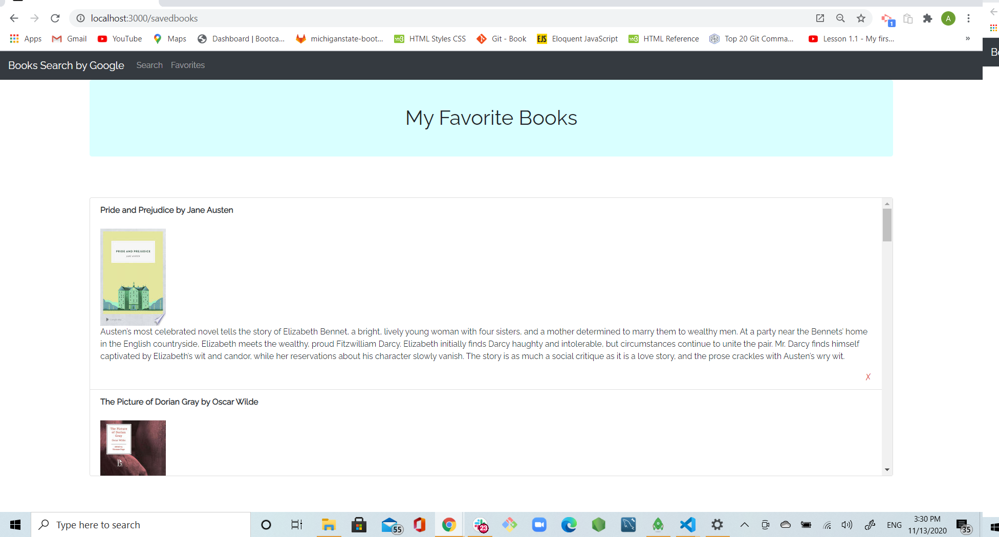

# google-books-search

## Username:

agorelik2

## Title:

### Google Book Search

[Link to the deployed application](https://google-books-search-alg.herokuapp.com/)

## Table of Content

- [Description](#description)
- [User Story](#user-story)
- [Functionality](#functionality)
- [Screen Shots](#screen-shots)
- [Development](#development)
- [Installation](#installation)
- [Dependencies](#dependencies)
- [Built With](#built-with)
- [Repo](#repo)
- [Demo](#demo)
- [Developer](#developer)

## Description

The Google Books Search app utilizes React and the Google Books API to enable users to search for and save titles they would like to read. The saved books are stored on MongoDB, which serves as a favorites list for the user. The application also lets you also open details where you can see more of the book and purchase it on Google.

## User Story

As a user, I want to be able to search books on Google and save my favorite search results so I could return to the results later and have the link to purchase the book.

## Functionality

1. Started by creating full stack structure for MERN app with REACT being a client. Used `npx create-react-app` to create REACT app in the `client` folder

2. On the clent side, created 2 pages (books.js and savedBooks.js) in client/src/pages

3. On the server side, created routes and controllers folders, and the code needed to read all the records, save the book document and delete book document

4. Added code to connect to a MongoDB database named `gbooks` using the mongoose npm package.

5. Using mongoose, then created a Book schema.

6. Books schema has the following fields:

```
  googleId: { type: String, required: true, unique: false },
  image: { type: String, required: true },
  title: { type: String, required: true },
  authors: [{ type: String, required: true }],
  description: { type: String, required: true },
  link: { type: String, required: true }
```

Creating `documents` in my `books` collection similar to the following:

    ```js
    {
      authors: ["Suzanne Collins"]
      description: "Set in a dark vision of the near future, a terrifying reality TV show is taking place. Twelve boys and twelve girls are forced to appear in a live event called The Hunger Games. There is only one rule: kill or be killed. When sixteen-year-old Katniss Everdeen steps forward to take her younger sister's place in the games, she sees it as a death sentence. But Katniss has been close to death before. For her, survival is second nature."
      image: "http://books.google.com/books/content?id=sazytgAACAAJ&printsec=frontcover&img=1&zoom=1&source=gbs_api"
      link: "http://books.google.com/books?id=sazytgAACAAJ&dq=title:The+Hunger+Games&hl=&source=gbs_api"
      title: "The Hunger Games"
    }
    ```

6. Created a layout similar to the mockups provided. This application uses [`react-router-dom`](https://github.com/reactjs/react-router) to navigate, hide and show your React components without changing the route within Express.

7. The layout should include at least two React Components for each page `Books` and `SavedBooks`.

## Screen Shots

The main screen of the application shows the search page, and displays the result of the search


The second screen shows saved books and allows user to find the book on google by clicking on its image


## Development

For this application, I have created React components, worked with helper/util functions, and utilized React lifecycle methods to query and display books based on user searches. I have also used Node, Express and MongoDB so that users can save books in MongoDB (gbooks) and return to buy the books later.
I have built back-end utilizing three different routes:

1. read all the books stored routes/api/books --> get
2. save a book routes/api/books --> post
3. delete a book routes/api/books/:id

## Installation

To use this application locally:

- Install Node.js on your computer
- Clone the application
- Use `npm install` to install all the dependencies, see [Dependencies](#dependencies) for the complete list
- npm install axios
- use `npm start`to start the development local environment
- to deploy to production, run `npm run build` and this will trigger the build and then you can publish on Heroku

## Dependencies

    "axios": "^0.18.1",
    "body-parser": "^1.19.0",
    "bootstrap": "^4.5.3",
    "connect-mongo": "^3.2.0",
    "express": "^4.16.3",
    "if-env": "^1.0.4",
    "jquery": "^3.5.1",
    "mongoose": "^5.3.16",
    "react": "^16.13.1",
    "react-bootstrap": "^1.3.0",
    "react-dom": "^16.13.1",
    "react-router-dom": "^5.2.0",
    "reactstrap": "^8.5.1",
    "dotenv": "^8.2.0"

    Also, DEV dependencies:

    "concurrently": "^4.1.2",
    "nodemon": "^1.18.7"

## Built With

- [VScode](https://code.visualstudio.com/)
- [Gitbash](https://gitforwindows.org/)
- [node.js](https://nodejs.org/en/)
- [express.js](https://expressjs.com/)
- [react.js](https://reactjs.org/)
- [MongoDB](https://www.mongodb.com/)
- [mongoose](https://mongoosejs.com/)
- [heroku](https://dashboard.heroku.com/apps)

## Repo:

https://github.com/agorelik2/google-books-search

## Demo:

https://google-books-search-alg.herokuapp.com/

## Developer

    Alina Gorelik
